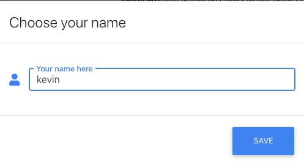
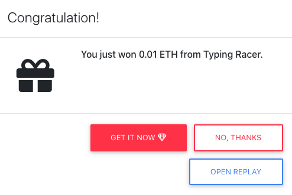

<h1 align="center">
   
      
   
  Typing Racer
   
</h1>

<h4 align="center">A type-racing game with crypto payout!</h4>

## Live Demo (Ropsten Network)

[typingracer.dotgrid.pro](http://typingracer.dotgrid.pro)

## 🚀 Getting Started

### 1. Install required software

- [Node.js](https://nodejs.org/en/download/)
- [Yarn](https://yarnpkg.com/getting-started/install)

### 2. Run The App

From inside project directory:

- Install dependencies with `yarn`.
- Start game with `yarn start`.
- The game is available at http://localhost:3000.

## 🕹 Playing A Game

- Choose a name:

- Type as fast as you can

- Get your reward

## 📼 Watching A Replay

- Once a game session finishes, a replay is saved client-side via IPFS. To watch the video, press the `Open Replay` button. A replay fragment will be inserted inside Navigation and Game Canvas, just wait a moment for replay became ready.

## Using the Saved Player Name

- In [Game/index.jsx](packages/typing-racer-client/src/components/Game/index.jsx#L125-L133), a modal will be opened for player name input, then save in database.

## Saving A Replay

- Game3.js uses the [MediaRecorder Web API](https://developer.mozilla.org/en-US/docs/Web/API/MediaRecorder) to save a replay of a game session on client-side IPFS.
- A [canvas object](packages/typing-racer-client/src/components/Game/index.jsx#L252-L264) which shows the game client is saved by the API
- Once a game starts [startRecording()](packages/typing-racer-client/src/components/Game/index.jsx#L172-L222) is called in Game/index.jsx
- Once the game is finished [stopRecording()](packages/typing-racer-client/src/components/Game/index.jsx#L224-L248) is called, which saves the stream onto a webm file stored in IPFS (see localSaveReplay()).

## Licenses

The major libraries and assets used in this project and their licenses:

- Colyseus: [MIT](https://github.com/colyseus/colyseus/blob/master/LICENSE)
- PIXI.js: [MIT](https://github.com/pixijs/pixi.js/blob/dev/LICENSE)
- Font "Press Start 2P": [Creative Common Zero](http://www.zone38.net/font/)
